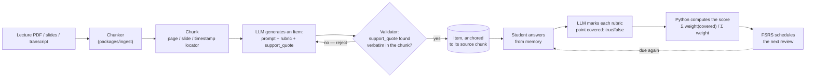

# NeuroAI Study Kit

[](https://github.com/carolinaporto/neuroai-studykit/actions/workflows/ci.yml)
[](LICENSE)

A personal **practice-testing** app for Harvard's GENED 1201 (*Foundations of NeuroAI*),
built and shipped end-to-end with Claude Code. In the product itself it's branded
**Synapse**; the repo keeps the descriptive name. It ingests lecture material — PDFs,
slide decks, transcripts — generates recall questions grounded in that source text, and
grades free-text answers against a rubric derived from the same text.

The core idea: **every question carries a pointer back to the exact passage that
justifies it.** No citation, no question. Grading doesn't compare your answer to a
model's opinion — it compares it to a rubric anchored in the source, and hands back the
passage (slide 12, page 7, 14:32–16:05) alongside the feedback.

<!-- TODO(demo gif): Sources → quiz → answer → anchored feedback, ~20s, no audio.
     Recorded separately from this pass — add  once it exists. -->



## Status

Functionally complete: source ingestion (PDF, slides, transcripts), question generation
with literal-quote validation, the study runner and rubric grader, a review queue,
embedding-based item dedup, spaced repetition (FSRS), a progress dashboard, weekly
check-in drafts, and real auth (Clerk, magic link). CI runs the full test suite on
every push.

**Deploy is in progress** — the API and database are live; the last piece being
verified is the connection between the API and the frontend. No public link yet — it'll
land here once that's confirmed working end-to-end.

See [`docs/ARCHITECTURE.md`](docs/ARCHITECTURE.md) for the full design.

## Design decisions & trade-offs

- **Literal citation, not semantic similarity.** A question's supporting quote must
  exist verbatim in the source text — no paraphrase, no "close enough."
- **The score is computed in Python, never asked of the LLM.** The model only judges
  whether each rubric point is covered; the grade itself is arithmetic.
- **A closed-scope grading endpoint.** A student's answer is passed as data, never
  concatenated into a prompt — it can't redirect what the model is asked to do.
- **Multi-user schema from day one**, even with a single real user — adding someone
  else is a config change, not a migration.

More in [`docs/ARCHITECTURE.md`](docs/ARCHITECTURE.md#11-riscos-e-como-cada-um-é-mitigado).

## Stack

| | |
|---|---|
| Backend | Python 3.12, FastAPI, SQLAlchemy 2.0 (async), Pydantic v2, Alembic — managed with [`uv`](https://docs.astral.sh/uv/) |
| Database | Postgres 16 + [pgvector](https://github.com/pgvector/pgvector) ([Neon](https://neon.com) in production) |
| Auth | [Clerk](https://clerk.com) (OIDC, magic link) |
| LLM | Anthropic (generation & grading), OpenAI embeddings (item dedup) |
| Frontend | React + Vite + TypeScript, TanStack Query |
| Tests | pytest (+ pytest-asyncio) · vitest |
| Lint/format | ruff · eslint + prettier |
| Deploy | Render (API) + Vercel (web) + Neon (Postgres) |

## Getting started

Requires [`uv`](https://docs.astral.sh/uv/), Node.js, and Docker.

```bash
cp .env.example .env        # then fill in your own secrets
cp apps/web/.env.example apps/web/.env
make up                     # postgres + pgvector, via docker compose
make test                   # backend + frontend test suites
make api                    # FastAPI with reload, on :8000
make web                    # Vite dev server
```

```bash
curl localhost:8000/health
# {"status":"ok","db":"ok"}
```

Other targets: `make lint` (ruff + eslint/prettier), `make migrate m="..."` /
`make upgrade` (Alembic).

## Repository layout

```
apps/
  api/          FastAPI app — routers, services, models, core config
  web/          React + Vite + TS frontend
packages/
  ingest/       Parsers, chunker, question generator — pure, no DB, no server
                (imported by apps/api and by a standalone CLI; never the reverse)
  db/           SQLAlchemy models + session factory, shared by apps/api and ingest
alembic/        Migrations
docker-compose.yml   Local Postgres + pgvector
docs/
  ARCHITECTURE.md         data model, pipeline, design decisions, risks
  IMPLEMENTATION_PLAN.md  milestone-by-milestone build order and acceptance criteria
design/synapse/          the app's design system — tokens, components, content rules
tests/          pytest suite; runs against a synthetic corpus, never real course content
.github/workflows/ci.yml Backend + frontend jobs, on every push
```

`content/` (lecture material) is gitignored on purpose — it isn't mine to redistribute.
Tests run on a synthetic corpus written from scratch, committed under `tests/fixtures/`.

## Why this exists

Built to satisfy GENED 1201's weekly check-in requirement the honest way: by actually
recalling the material, not rereading slides. The design choices above, and the ones
that didn't fit here, are documented in full in
[`docs/ARCHITECTURE.md`](docs/ARCHITECTURE.md#11-riscos-e-como-cada-um-é-mitigado).

## License

MIT — see [`LICENSE`](LICENSE).
