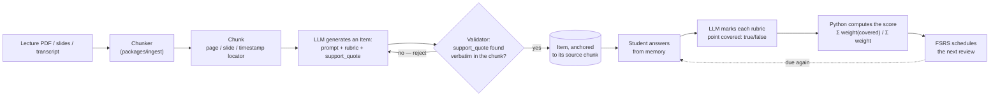

# NeuroAI Study Kit

[](https://github.com/carolinaporto/neuroai-studykit/actions/workflows/ci.yml)
[](LICENSE)

A personal **practice-testing** app for Harvard's GENED 1201 (*Foundations of NeuroAI*),
built and shipped end-to-end with Claude Code. In the product itself it's branded
**Synapse**; the repo keeps the descriptive name. It ingests lecture material — PDFs,
slide decks, transcripts — generates recall questions grounded in that source text, and
grades free-text answers against a rubric derived from the same text.

The core idea: **every question carries a pointer back to the exact passage that
justifies it.** No citation, no question. Grading doesn't compare your answer to a
model's opinion — it compares it to a rubric anchored in the source, and hands back the
passage (slide 12, page 7, 14:32–16:05) alongside the feedback.

<!-- TODO(demo gif): Sources → quiz → answer → anchored feedback, ~20s, no audio.
     Recorded separately from this pass — add  once it exists. -->



## Status

M0 through M12 are done — parsing/chunking, question generation with literal-quote
validation, the study runner and rubric grader, the review queue, embedding-based item
dedup, CI, FSRS spaced repetition, the progress and weekly check-in pages, and real auth
(Clerk, magic link). **M13 (deploy) is in progress** — the API (Render) and database
(Neon, Postgres + pgvector) are live; the frontend (Vercel) is deployed and the last
piece being verified is CORS between the two. No public live link yet — it'll land here
once that's confirmed working end-to-end, not before.

See [`docs/IMPLEMENTATION_PLAN.md`](docs/IMPLEMENTATION_PLAN.md) for the milestone
roadmap and [`docs/ARCHITECTURE.md`](docs/ARCHITECTURE.md) for the full design — data
model, ingestion pipeline, grading flow, and the reasoning behind each decision.

## Design decisions & trade-offs

A few choices worth calling out, in rough order of how much they shape the app:

- **Literal citation, not semantic similarity.** Every rubric point's `support_quote`
  must exist verbatim in its source chunk — checked in
  [`packages/ingest/validators.py`](packages/ingest/validators.py), with exactly one
  normalization (collapsing whitespace, nothing else: no case-folding, no unicode/quote
  normalization). That one exception exists because PyMuPDF breaks lines mid-sentence
  when it extracts PDF text and an LLM naturally normalizes that break when quoting —
  without it, every item generated from a real PDF was rejected on an extraction
  artifact, not on an actual hallucination (8/8 items in one real chunk, before the
  fix). "Almost matches" was deliberately never allowed to become the threshold.
- **The score is computed in Python, never asked of the LLM.** The model only judges
  `covered: true | false` per rubric point; `Σ weight(covered) / Σ weight` is arithmetic,
  not a model's opinion of a grade.
- **A closed-scope grading endpoint.** `/api/study/answer` takes an `item_id` and the
  student's raw text — never a prompt. The student's text is always passed as delimited
  data, never concatenated into an instruction role, so it can't redirect what the model
  is asked to do.
- **Multi-user schema since v1**, even with a single real user. `owner_id`,
  `Deck.visibility`, and `User.role` (owner/student/demo) exist from the first migration
  — adding a second real user is a config-file line (`ALLOWED_EMAILS`), not a schema
  migration.
- **Item dedup by embedding, not exact match** ([`packages/ingest/dedup.py`](packages/ingest/dedup.py)):
  a new item's prompt embedding is compared by cosine similarity (pgvector,
  threshold 0.92) against existing items in the same week, catching paraphrased
  duplicates a string comparison would miss.
- **FSRS, not a naive spaced-repetition curve** — `apps/api/services/scheduling.py`
  maps each graded attempt to an FSRS grade and lets the algorithm own the review
  schedule, rather than hand-rolling interval math.
- **Two real, recent infra trade-offs, made deliberately, not by accident:** the
  database runs on Neon rather than Render/Railway's own Postgres, because Render's
  free Postgres tier expires after 30 days and Neon's doesn't; and the auth provider
  (Clerk) runs its **Development** instance in production rather than paying for a
  custom domain just to unlock a Production instance — a fine trade for a single-owner
  personal app, revisited the moment that stops being true.

More of these — and the ones that didn't make this list — are in
[`docs/ARCHITECTURE.md`](docs/ARCHITECTURE.md#11-riscos-e-como-cada-um-é-mitigado).

## Stack

| | |
|---|---|
| Backend | Python 3.12, FastAPI, SQLAlchemy 2.0 (async), Pydantic v2, Alembic — managed with [`uv`](https://docs.astral.sh/uv/) |
| Database | Postgres 16 + [pgvector](https://github.com/pgvector/pgvector) ([Neon](https://neon.com) in production) |
| Auth | [Clerk](https://clerk.com) (OIDC, magic link) |
| LLM | Anthropic (generation & grading), OpenAI embeddings (item dedup) |
| Frontend | React + Vite + TypeScript, TanStack Query |
| Tests | pytest (+ pytest-asyncio) · vitest |
| Lint/format | ruff · eslint + prettier |
| Deploy | Render (API) + Vercel (web) + Neon (Postgres) |

## Getting started

Requires [`uv`](https://docs.astral.sh/uv/), Node.js, and Docker.

```bash
cp .env.example .env        # then fill in your own secrets
cp apps/web/.env.example apps/web/.env
make up                     # postgres + pgvector, via docker compose
make test                   # backend + frontend test suites
make api                    # FastAPI with reload, on :8000
make web                    # Vite dev server
```

```bash
curl localhost:8000/health
# {"status":"ok","db":"ok"}
```

Other targets: `make lint` (ruff + eslint/prettier), `make migrate m="..."` /
`make upgrade` (Alembic).

## Repository layout

```
apps/
  api/          FastAPI app — routers, services, models, core config
  web/          React + Vite + TS frontend
packages/
  ingest/       Parsers, chunker, question generator — pure, no DB, no server
                (imported by apps/api and by a standalone CLI; never the reverse)
  db/           SQLAlchemy models + session factory, shared by apps/api and ingest
alembic/        Migrations
docker-compose.yml   Local Postgres + pgvector
docs/
  ARCHITECTURE.md         data model, pipeline, design decisions, risks
  IMPLEMENTATION_PLAN.md  milestone-by-milestone build order and acceptance criteria
design/synapse/          the app's design system — tokens, components, content rules
tests/          pytest suite; runs against a synthetic corpus, never real course content
.github/workflows/ci.yml Backend + frontend jobs, on every push
```

`content/` (lecture material) is gitignored on purpose — it isn't mine to redistribute.
Tests and the demo GIF above run on a synthetic corpus written from scratch, committed
under `tests/fixtures/`.

## Why this exists

Built to satisfy GENED 1201's weekly check-in requirement the honest way: by actually
recalling the material, not rereading slides. The design choices above, and the ones
that didn't fit here, are documented in full in
[`docs/ARCHITECTURE.md`](docs/ARCHITECTURE.md#11-riscos-e-como-cada-um-é-mitigado).

## License

MIT — see [`LICENSE`](LICENSE).
