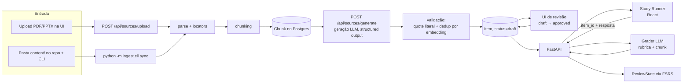

# NeuroAI Study Kit — Arquitetura

**Curso:** GENED 1201 — Foundations of NeuroAI
**Stack:** FastAPI (Python) + React (Vite/TS) + Postgres/pgvector
**Modo de IA:** banco de questões pré-gerado (offline) + correção ao vivo contra a fonte
**Acesso:** repositório público (portfólio), site privado (uso pessoal), com as costuras
prontas para abrir a estranhos ou a colegas depois, sem refatoração

---

## 1. O princípio que organiza tudo

O requisito pedagógico do curso não é "um site de quiz". É **practice testing**: o sistema
tem que te obrigar a *gerar* a resposta de memória e depois *verificar* contra o material
primário da aula.

Disso sai a regra que define o schema inteiro:

> **Toda questão carrega um ponteiro para o trecho exato da fonte que a justifica.**

Uma questão sem âncora não entra no banco. A correção não julga sua resposta contra a
opinião do modelo — julga contra uma rubrica derivada do trecho, e devolve o trecho junto
com o feedback (slide 12, página 7, 14:32–16:05). É isso que transforma o app de "IA me
disse que errei" em "eis a frase da aula que você não recuperou".

Duas consequências práticas:

- **Geração é offline e revisada por você.** Questão gerada nasce `draft`. Você aprova
  (ou edita) antes de ela virar item de estudo. Revisar 30 questões por semana *já é*
  estudo ativo, e é o filtro que impede alucinação de contaminar o kit.
- **Correção é online, mas de escopo fechado.** O endpoint recebe `item_id + resposta`,
  nunca um prompt livre. Isso é ao mesmo tempo a defesa contra abuso do site público e
  a garantia de que a correção sempre olha para a fonte certa.

---

## 2. Visão geral

Não existe worker nem fila separada — a ingestão roda **síncrona**, dentro da própria
requisição HTTP (`POST /api/sources/upload`) ou do processo do CLI
(`python -m ingest.cli`). `IngestJob` registra o resultado de cada rodada (status, erro),
mas nada além do processo que já está rodando o consome.



---

## 3. Modelo de dados

Estado real (`packages/db/models.py`), não o desenho original — ver nota de multiusuário
abaixo sobre uma diferença deliberada em relação ao rascunho inicial deste documento.

```
User
  id, email, clerk_user_id, role: owner | student | demo, created_at

Source                        # uma aula, slides, transcrição ou paper
  id, owner_id, week:int|null, title, kind: lecture_pdf|slides|transcript|paper|notes
  storage_uri, file_data: bytea|null, file_media_type, sha256, page_count, duration_seconds
  status: pending|ingested|failed, ingested_at
  -- sha256 evita reingerir o mesmo arquivo; file_data guarda os bytes direto no Postgres
  -- (nunca em R2/S3 — ver §9), null quando a fonte veio do CLI, que só referencia o
  -- caminho local em storage_uri

Chunk                         # a ÂNCORA de citação
  id, source_id, ordinal, text
  locators: jsonb[]  -- [{page: 7}] | [{slide: 12}] | [{t0: 872, t1: 965}]
  token_count, embedding: vector(1536)  -- coluna existe, ainda não escrita por nada (dormant)

Item                          # uma questão
  id, source_id, chunk_ids: uuid[]
  type: free_recall | term_def | cloze | mcq | compare | application
  prompt, reference_answer
  rubric: jsonb   -- [{id, point, weight, support_quote}, ...]
  choices: jsonb|null  -- só para mcq
  difficulty:1-5, bloom: recall|understand|apply|analyze
  topics: text[]  -- vocabulário controlado, topics.yaml
  status: draft | approved | edited | retired
  gen_model, gen_prompt_version, created_at
  embedding: vector(1536)|null  -- do prompt, para dedup (M7 part 2); Chunk.embedding acima
                                 -- é uma coluna diferente, ainda dormant

QuizAttempt                   # uma passada pelo recall check de uma semana
  id, user_id, week, item_ids: uuid[]  -- congelado na criação
  status: in_progress | completed, score: float|null, completed_at

Attempt
  id, user_id, item_id, quiz_attempt_id: uuid|null  -- null = resposta avulsa, fora de quiz
  response_text, response_hash
  score: float 0-1, rubric_hits: jsonb  -- [{point_id, covered, evidence}]
  misconceptions: text[], feedback_md
  grader_model, latency_ms, tokens_used, created_at

ReviewState                   # FSRS por (user, item) — uq(user_id, item_id)
  user_id, item_id, stability, difficulty, due_at, reps, lapses, last_grade
  last_reviewed_at, fsrs_card: jsonb  -- fsrs.Card.to_dict(), fonte da verdade do algoritmo

Homework                      # entrada de portfólio pública (design/synapse's HomeworkCard)
  id, owner_id, week, title, description, disciplines: text[]
  code_url, live_url, status: draft | published
  -- guarda só metadado + links de saída; o conteúdo do homework é um projeto à parte

Note                          # anotação pessoal (design/synapse's InsightNote)
  id, owner_id, title, body:text|null, url:text|null, disciplines: text[]
  week:int|null, source_id:uuid|null, is_public: bool = false

IngestJob
  id, source_id, kind: parse_and_chunk|generate, status: queued|running|done|failed
  attempts, error, payload: jsonb, locked_at, locked_by
```

Notas de design:

- `rubric.support_quote` é o guard-rail barato: se a citação que o modelo alega não
  aparecer *literalmente* no chunk, o item é descartado na validação. Sem chamada extra
  de LLM, pega a maior parte das invenções.
- `topics[]` é o que alimenta o painel de fraquezas. Mantenha um vocabulário controlado
  (`topics.yaml` no repo) e peça ao gerador para escolher dessa lista — senão você
  termina com "backprop", "back-propagation" e "gradient descent" como três tópicos.
- `Attempt` guarda a resposta bruta. Depois de um mês você tem um corpus do que você
  *acha* que sabe versus o que recupera — que é, inclusive, material para o check-in
  semanal.
- **As costuras de multiusuário existem desde a v1, a UI não — mas não como um `Deck`
  separado.** O rascunho original desta seção previa uma tabela `Deck` com
  `visibility: private|shared|public_demo` agrupando itens; na prática o que foi
  construído é mais simples e direto: `owner_id` em cada tabela dona de conteúdo
  (`Source`, `Homework`, `Note`), `User.role` para o papel, e visibilidade por linha onde
  faz sentido (`Note.is_public`; `Homework` é público por padrão quando `published`,
  `Source`/`Item` nunca são). Mesmo efeito prático do desenho original — abrir pra
  colegas é mudar um valor, não migrar tabela — sem a indireção de um `Deck` que nada
  além do design original chegou a precisar.

---

## 4. Pipeline de ingestão

Três entradas, um caminho único a partir do `IngestJob`:

| Entrada | Parser | Locator gerado |
|---|---|---|
| PDF de aula/paper | PyMuPDF (`fitz`) | `{page: n}` |
| Slides `.pptx` | python-pptx (texto + speaker notes) | `{slide: n}` |
| Transcrição | VTT/SRT existente, ou `faster-whisper` | `{t0, t1}` em segundos |
| `content/` no repo | `python -m ingest.cli sync content/week03` | herda do tipo do arquivo |

Etapas:

1. **Hash e dedup de fonte** — `sha256` igual, pula.
2. **Parse** preservando o locator por bloco de texto.
3. **Chunking semântico** — agrupa por heading/slide, alvo de 500–900 tokens, overlap de
   ~15%. Nunca corte no meio de uma definição: prefira quebrar em heading, e se um slide
   for curto, junte com o vizinho mantendo os dois locators.
4. **Embeddings** — não dos chunks (`Chunk.embedding` existe na coluna mas nada escreve
   nela ainda); o dedup real (passo 7) usa o embedding do *enunciado do item*, gerado
   depois que o item já existe.
5. **Geração** — 1 chamada por grupo de chunks, saída estruturada validada por um modelo
   Pydantic (`GeneratedItemBatch`). Peça uma *mistura* de tipos por chunk, não 5 questões
   do mesmo formato. O prompt vai versionado em `packages/ingest/prompts/generate_v4.md`
   e o hash dele fica em `Item.gen_prompt_version` — assim você sabe quais questões vieram
   de qual versão quando melhorar o prompt.
6. **Validação** — quote literal presente no chunk; rubrica com 2–5 pontos; nenhum item
   respondível sem ter lido a fonte (rejeitar "O que é X?" quando X está no enunciado).
7. **Dedup de item** — embedding do `prompt`, descarta se cosseno > 0.92 contra item
   existente da mesma semana.
8. `status = draft` → fila de revisão.

**Sem fila, sem worker.** `IngestJob` registra o resultado de cada rodada (status, erro,
tentativas) para auditoria, mas ninguém a consome de forma assíncrona — parse, chunking e
geração rodam síncronos dentro da própria requisição (`POST /api/sources/upload`,
`POST /api/sources/generate`) ou do processo do CLI. Isso evita adicionar Redis + Celery
a um projeto solo com volume baixo. Se um dia o volume justificar processamento em
background de verdade, `arq` é a opção mais barata a considerar — a tabela já existe.

---

## 5. Correção ao vivo

```
POST /api/study/answer  { item_id, response_text, quiz_attempt_id? }
```

`quiz_attempt_id` é opcional — presente quando a resposta é um item de um `QuizAttempt`
(o recall check semanal), ausente para uma resposta avulsa fora de qualquer quiz.

1. Carrega `Item` + `rubric` + o texto dos `chunk_ids`.
2. Uma chamada de LLM com saída estruturada:
   ```json
   { "points": [{"point_id":"p1","covered":true,"evidence":"trecho da resposta do aluno"}],
     "misconceptions": ["confundiu tuning curve com receptive field"],
     "feedback_md": "2 frases, corretivas, citando a fonte" }
   ```
3. **O score é calculado em Python**, não pelo modelo: `Σ(weight de pontos cobertos) / Σ(weight)`.
   Nota gerada por LLM oscila entre execuções; agregação determinística não.
4. Resposta inclui `reference_answer`, os pontos verdes/vermelhos, e o **locator + trecho**
   da fonte, para você pular direto ao slide.
5. `ReviewState` atualizado por FSRS a partir do score (>0.85 = good, 0.6–0.85 = hard,
   <0.6 = again).
6. **Cache** em `hash(item_id + resposta normalizada)` — respostas repetidas não gastam token.

Para `mcq` e `cloze`, a correção é determinística: zero chamada de LLM. Só
`free_recall`, `term_def`, `compare` e `application` passam pelo grader.

---

## 6. Layout do repositório

```
neuroai-studykit/
├─ apps/
│  ├─ api/                    # FastAPI — sem worker, um processo só
│  │  ├─ routers/             auth checkin homework items notes progress sources study
│  │  ├─ services/            grading scheduling mastery budget
│  │  ├─ core/                config.py (pydantic-settings) auth.py deps.py db.py llm.py
│  │  ├─ schemas/              Pydantic I/O — nunca o ORM direto na resposta
│  │  └─ prompts/              grade_v1.md (o prompt do corretor, versionado)
│  └─ web/                    React + Vite + TS + TanStack Query
│     └─ src/pages/           Overview Sources Review Quizzes Progress Checkin Notes Homework
├─ packages/
│  ├─ db/                     modelos ORM (SQLAlchemy 2.0 async) + session factory —
│  │                          compartilhado por apps/api e packages/ingest
│  └─ ingest/                 parsers, chunker, generator, prompts/, dedup.py, cli.py
│                             (importado pela API *e* pelo CLI — uma implementação só)
├─ design/synapse/             design system (tokens, componentes, regras de conteúdo)
├─ content/                   material do curso  ← GITIGNORED (ver §8)
├─ alembic/                   migrations
├─ docker-compose.yml         só o banco (postgres+pgvector) — api e web rodam direto,
│                             local e em produção (ver §9)
└─ .env.example
```

Regra que vale ouro: **`packages/ingest` não importa nada de `apps/api`.** Ele recebe
bytes e devolve objetos Pydantic. É isso que permite rodar a ingestão pelo CLI sem subir
servidor, e testá-la sem banco.

### Contratos de API (real)

```
GET    /api/auth/session                verifica o token Clerk, devolve {signed_in, role}
GET    /api/sources                     lista fontes por semana + status de ingestão
POST   /api/sources/upload              upload multipart → parse + chunk síncrono
POST   /api/sources/generate            gera Item a partir dos chunks de uma semana
GET    /api/sources/{id}                detalhe de uma fonte
GET    /api/sources/{id}/file           bytes originais do arquivo
DELETE /api/sources/{id}
GET    /api/items/review                fila de revisão (owner), agrupada por semana
PATCH  /api/items/{id}                  aprovar / editar / aposentar
POST   /api/study/session               fila de itens para prática avulsa
POST   /api/study/answer                correção por rubrica (score em Python)
GET    /api/study/items/{id}/source     passagem-fonte de um item ("não sei essa")
POST   /api/study/quiz                  inicia o recall check de uma semana
GET    /api/study/weeks                 semanas com quiz disponível
GET    /api/study/quiz/{id}             revisão de um QuizAttempt concluído
GET    /api/progress                    mastery por tópico, due counts
GET    /api/checkin/draft?week=3        rascunho do check-in semanal a partir das stats
GET    /api/notes · POST /api/notes · PATCH /api/notes/{id}
GET    /api/homework · POST /api/homework · PATCH /api/homework/{id}   -- só Homework é público
```

---

## 7. Auth, segredos e custo

Três coisas distintas que a palavra "público" confunde, decididas separadamente:

| | v1 | depois |
|---|---|---|
| **Código** (GitHub) | público — é o portfólio | — |
| **Site** (a URL) | privado, só você entra | opcional: convite a colegas, ou demo anônimo |
| **Conteúdo** (fontes, notas) | tudo privado | notas públicas por opt-in; Homework é público por padrão |

- **`ANTHROPIC_API_KEY` só existe no backend.** `core/config.py` com `pydantic-settings`,
  `.env` gitignorado, `.env.example` commitado. O bundle do React nunca toca em chave —
  nem em variável `VITE_*`, que **vai para o cliente** e é a pegadinha clássica. Isso vale
  independentemente do site ser privado: o repo é público e o histórico do git é para
  sempre.
- **Auth: Clerk** (decidido no M12 — Auth0 tinha free tier só por tempo limitado, não um
  plano grátis de verdade), OIDC com magic link, emitindo JWT; o FastAPI só *verifica*, em
  `apps/api/core/deps.py::get_current_user_id`. Um usuário só, mas auth de verdade — você
  demonstra a competência sem virar responsável por armazenar senha, e sem inventar
  criptografia. Roda com a instância **Development** da Clerk mesmo em produção — uma
  instância "Production" de verdade exige domínio próprio, que este projeto optou por não
  ter (ver §9); trade-off razoável para um app de um usuário só.
- **Papéis no enum desde já:** `owner` (ingere, aprova, vê tudo) · `student` (estuda decks
  a que foi convidado) · `demo` (anônimo, só `public_demo`, sem escrita). Na v1 só existe
  `owner`; os outros dois são a costura.
- **Allowlist de e-mail** em vez de porta aberta: `ALLOWED_EMAILS` no env. Quem não está na
  lista não cria conta, mesmo tendo a URL. É uma linha de código e é a coisa que
  efetivamente mantém o site privado.
- **Superfície de abuso fechada, ainda que privada:** nenhum endpoint aceita prompt livre.
  O grader recebe `item_id` + texto do aluno, e o texto entra na chamada **como dado
  delimitado**, nunca concatenado no papel de instrução. Vale manter assim desde o começo
  porque é o que torna abrir o site depois uma decisão de configuração, não de reescrita.
- **Orçamento:** teto diário de tokens por usuário em `services/budget.py` desde a v1 — o
  risco real com site privado não é abuso, é um bug de loop na ingestão consumindo a conta
  numa madrugada. Rate limit por IP entra junto com o acesso público, se ele vier.
- CORS restrito à origem do front (regex de localhost em dev, `WEB_ORIGIN` explícito em
  produção). Uploads: só `.pdf/.pptx/.vtt/.srt`, até 50 MB, bytes guardados por UUID
  (nunca pelo nome original do arquivo).

**O portfólio não depende do site estar aberto.** O que um recrutador avalia é o repo: o
`README` com um GIF do loop de estudo rodando, o desenho do pipeline de ingestão, a
validação de citação literal, os testes com corpus sintético, as migrations. Um link
"vídeo de 2 min" vale mais que uma URL pública — e não te custa auth com papéis, rate
limit e sanitização de abuso.

---

## 8. Direito autoral — decisão de arquitetura, não detalhe

O repo é público (portfólio). Os PDFs e slides do GENED 1201 **não são seus para
redistribuir**. Então:

- `content/` fica no `.gitignore`; o storage de produção é privado.
- Questões geradas a partir do material são trabalho derivado — mantenha-as no banco
  privado, não em fixtures do repo. Os testes usam um **corpus sintético** em
  `tests/fixtures/`: dois ou três "textos de aula" que você mesmo escreve, sobre conceitos
  básicos, suficientes para exercitar parser, chunker, gerador e grader de ponta a ponta.
- Esse mesmo corpus sintético é o que serviria de conteúdo de demonstração, se um dia o
  site abrir pra estranhos. Ou seja: escrevê-lo agora não é trabalho jogado fora — é o
  fixture de teste e a vitrine futura na mesma pasta, mesmo que hoje nada em `content/`
  além do `README.md` esteja de fato commitado.
- O GIF do `README` (quando gravado) usa o app rodando local, não a Semana 3 do GENED.

Isso não é só conformidade: um recrutador que abre o repo e vê `content/` vazio com um
`README` explicando o porquê lê isso como bom julgamento.

---

## 9. Deploy

Implantado no M13 — o que segue é o que de fato está no ar, não o desenho original desta
seção (que previa um worker separado e storage em R2; nenhum dos dois chegou a existir).

- **Postgres (pgvector):** Neon. Free tier, sem prazo de expiração, pgvector incluso sem
  custo extra (confirmado em `neon.com/docs` — diferente do Postgres free do Render/Railway,
  que expira). O compute dorme após inatividade e acorda sozinho na próxima conexão.
- **API:** Render, ambiente nativo Python (sem Dockerfile), tier grátis de web service.
  Um serviço só — não existe worker; toda geração/correção roda inline na requisição.
- **Web:** Vercel, tier grátis, autodetecta Vite.
- **Arquivos:** ficam em bytea no Postgres (não em R2/S3) — decisão de antes deste marco,
  simples o bastante pro volume de um app pessoal.
- `docker-compose.yml` reproduz o banco local para desenvolvimento (`make up`); API e web
  rodam direto via `make api`/`make web`, sem container, tanto local quanto em produção.

---

## 10. Roadmap por fases

**Fase 1 — o loop fechado (MVP).**
Ingestão só por `content/` + CLI. Parser de PDF. Chunking. Geração de `free_recall` e
`term_def`. Tabelas `Source/Chunk/Item/Attempt` (já com `owner_id`, a costura de
multiusuário — ver §3). Study runner com correção por rubrica. Um usuário, sem auth
ainda — `owner_id` fixo via env.
*Critério de pronto: você estuda a Semana 1 de verdade no seu app.*

**Fase 2 — confiança.** UI de revisão draft→approved. Dedup. Validação de quote literal.
Tipos `cloze` e `mcq` com correção determinística. Corpus sintético em
`tests/fixtures/` + testes do pipeline.

**Fase 3 — o sistema de estudo.** FSRS e fila de revisão por vencimento. Página de
progresso por tópico. Gerador de rascunho do check-in semanal.

**Fase 4 — fechar a porta.** Auth OIDC com magic link + allowlist de e-mail, teto de
tokens, deploy. Curto: é a fase que torna o site seguro de deixar no ar, não a que o abre.

**Fase 5 — portfólio.** `README` com GIF do loop, diagrama, seção de decisões de design,
CI rodando os testes. **É esta a fase que faz o trabalho de portfólio**, não um site aberto.

**Fase 6 — extras, por vontade.** Upload pela UI, transcrições com Whisper, modo exame
cronometrado, busca semântica. E, se der vontade: convite a colegas (um segundo e-mail em
`ALLOWED_EMAILS`, role `student`) ou demo anônimo (rate limit por IP) — as costuras já
estão no lugar desde a Fase 1, mesmo sem UI nenhuma construída em cima delas ainda (ver §3
sobre a diferença entre esse plano e o `Deck.visibility` do rascunho original).

Construa nessa ordem. A Fase 1 já satisfaz o requisito do curso; a Fase 5 é o portfólio.

---

## 11. Riscos e como cada um é mitigado

| Risco | Mitigação já embutida no design |
|---|---|
| Questão alucinada vira estudo errado | `support_quote` verificada literalmente + aprovação manual |
| Nota do grader instável entre execuções | rubrica fixa + agregação determinística em Python |
| Conta de API explodindo (bug de loop na ingestão) | teto diário de tokens, cache, endpoint de escopo fechado |
| Chave vazando no bundle ou no histórico do git | chave só no backend; `VITE_*` nunca recebe segredo; `.env` gitignorado desde o primeiro commit |
| Abrir o site depois exigir reescrita | `owner_id`/`is_public`/`role` e filtro por usuário desde a v1 |
| Questões redundantes entre aulas | dedup por embedding do enunciado |
| Estudo virar releitura passiva | resposta digitada obrigatória antes de revelar o gabarito |
| Material do curso num repo público | `content/` gitignorado; testes e demo futuro rodam no corpus sintético de `tests/fixtures/` |
```
